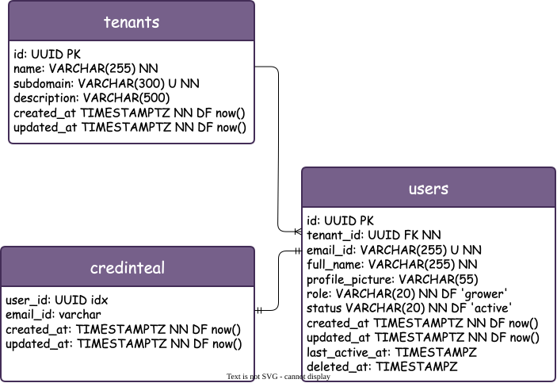

# farm-deck
The farm command-deck: fields, hydro systems, daily logs, reminders and reports for a portfolio farm SaaS.

## Database diagram

> High-resolution [PNG version](docs/db_diagram.png) · editable source: [`docs/db_diagram.drawio`](docs/db_diagram.drawio)

The diagram covers the multi-tenant schema — tenants, users & credentials, farm/zone/soil/hydro lookup data, crop catalog, cycles, daily logs and harvests.
